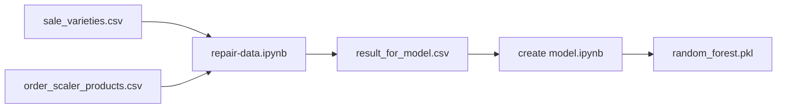

# Real-Time Inventory Prediction Model — Mivechy

A machine learning project to **estimate remaining product inventory** at Mivechy stores, based on sales history from digital scales and the product variety hierarchy.

The final output is a **Random Forest** regressor that predicts inventory levels for each three-hour time slot using features such as date, variety, quality grade, time of day, and season.

---

## Objective

In practice, true inventory for each product is not continuously available throughout the day—only **sales amounts** are recorded per time window. This project:

1. Derives **decremental inventory** (remaining stock after each sales window) from raw order data.
2. Trains a regression model to **estimate real-time inventory** for new combinations (date, variety, time slot, etc.).

---

## Project Structure

```
InstantInventroyModel/
├── Data/
│   ├── sale_varieties.csv          # Variety tree (parent / child)
│   ├── order_scaler_products.csv   # Orders recorded from scales
│   └── result_for_model.csv        # Training-ready output (after repair-data)
├── repair-data.ipynb               # Data preparation and dataset build
├── create model.ipynb              # Training, evaluation, and model export
└── random_forest.pkl               # Trained model (after running create model)
```

---

## Pipeline



### 1. Data preparation — `repair-data.ipynb`

| Step | Description |
|------|-------------|
| Variety tree | Builds parent (`source_variety_id`) and child relationships from `sale_varieties.csv`. |
| Order grouping | Aggregates orders by `variety_id`, `grade`, `order_date`, `order_time`. |
| Time buckets | Maps exact clock time to six three-hour windows: `06:00-08:59` through `21:00-23:59`. |
| Decremental inventory | For each day and variety, computes remaining stock per window with `total - cumsum + amount`. |
| Gap filling | Empty time windows are filled with the previous inventory value. |
| Season | Derives `season` (1–4) from the Jalali calendar month. |
| Output | Writes `Data/result_for_model.csv`. |

Key columns in `result_for_model.csv`:

| Column | Meaning |
|--------|---------|
| `order_date` | Jalali date (e.g. `14010315`) |
| `variety_id` | Product variety ID |
| `grade` | Quality grade |
| `order_time` | Three-hour time window |
| `source_id` | Parent variety (inventory source) |
| `inventory` | **Model target** — remaining stock in that window |
| `total_inventory` | Total daily inventory for that variety |
| `season` | Season (1=spring, 2=summer, 3=autumn, 4=winter) |

### 2. Model training — `create model.ipynb`

1. Load `Data/result_for_model.csv` and drop helper columns (`descendants`, `amount`, etc.).
2. Map `order_time` to `order_range` (integer 1–6).
3. Split 80/20 train/test.
4. Compare several algorithms (Random Forest, Linear Regression, Decision Tree, Gradient Boosting, etc.).
5. Train the final **Random Forest** and save it as `random_forest.pkl`.

**Input features (X):**  
`order_date`, `variety_id`, `grade`, `source_id`, `total_inventory`, `season`, `order_range`

**Target (y):**  
`inventory`

---

## Evaluation Results (from notebook)

| Model | MAE | RMSE | R² |
|-------|-----|------|-----|
| Random Forest (initial comparison) | 0.78 | 4.75 | 0.99 |
| Decision Tree | 0.68 | 6.24 | 0.98 |
| Random Forest (final saved model) | 1.76 | 8.34 | 0.97 |

The final model is trained with:

- `n_estimators=100`, `max_depth=12`
- `min_samples_leaf=5`, `min_samples_split=10`
- `max_features="sqrt"`

---

## Prerequisites

- Python 3.10+
- Jupyter Notebook or JupyterLab

### Install dependencies

```bash
pip install pandas numpy scikit-learn joblib jupyter
```

Optional XGBoost comparison (commented out in the notebook):

```bash
pip install xgboost
```

---

## How to Run

1. Place raw data files in the `Data/` folder (`sale_varieties.csv`, `order_scaler_products.csv`).
2. Run `repair-data.ipynb` end to end to generate `result_for_model.csv`.
3. Run `create model.ipynb` to train the model and save `random_forest.pkl`.

---

## Using the Saved Model

```python
import joblib
import pandas as pd

model = joblib.load("random_forest.pkl")

# Sample input — replace with real values
sample = pd.DataFrame([{
    "order_date": 14040315,
    "variety_id": 56,
    "grade": 1,
    "source_id": 56,
    "total_inventory": 10.0,
    "season": 2,
    "order_range": 3,  # 12:00-14:59
}])

predicted_inventory = model.predict(sample)[0]
print(f"Predicted inventory: {predicted_inventory:.2f}")
```

**`order_range` mapping:**

| order_range | Time window |
|-------------|-------------|
| 1 | 06:00-08:59 |
| 2 | 09:00-11:59 |
| 3 | 12:00-14:59 |
| 4 | 15:00-17:59 |
| 5 | 18:00-20:59 |
| 6 | 21:00-23:59 |

---

## Data Sources

| File | Approximate source |
|------|-------------------|
| `order_scaler_products.csv` | Orders recorded in **MivechyWeightScaler** (scale app) |
| `sale_varieties.csv` | Sales variety table from the Mivechy system |

To refresh the model, export new data, re-run `repair-data.ipynb`, then re-train with `create model.ipynb`.

---

## License & Ownership

Internal **Mivechy** project — external use without coordination is not permitted.
